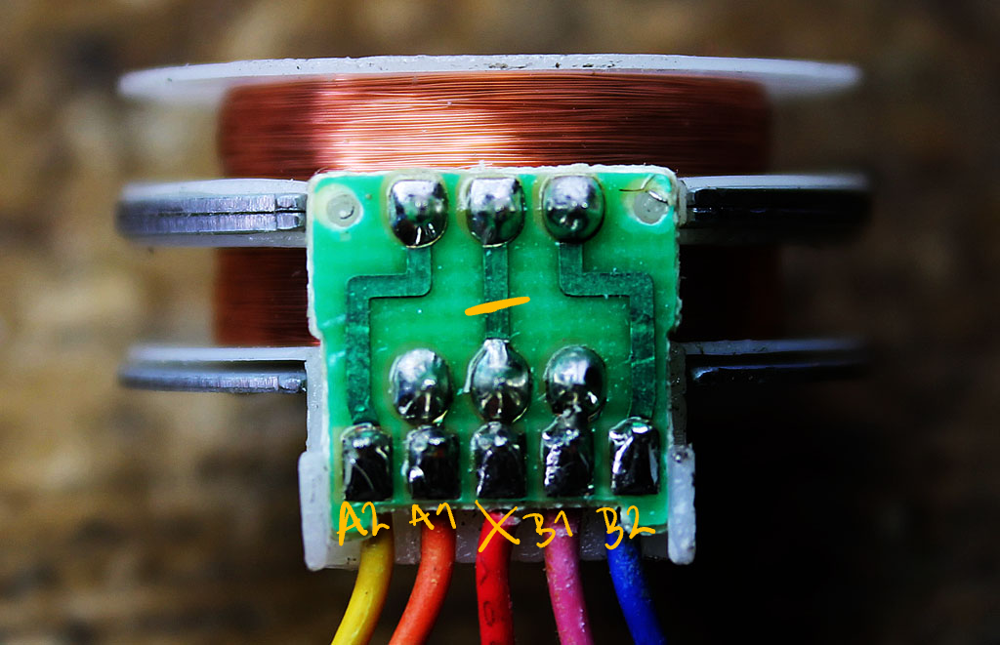
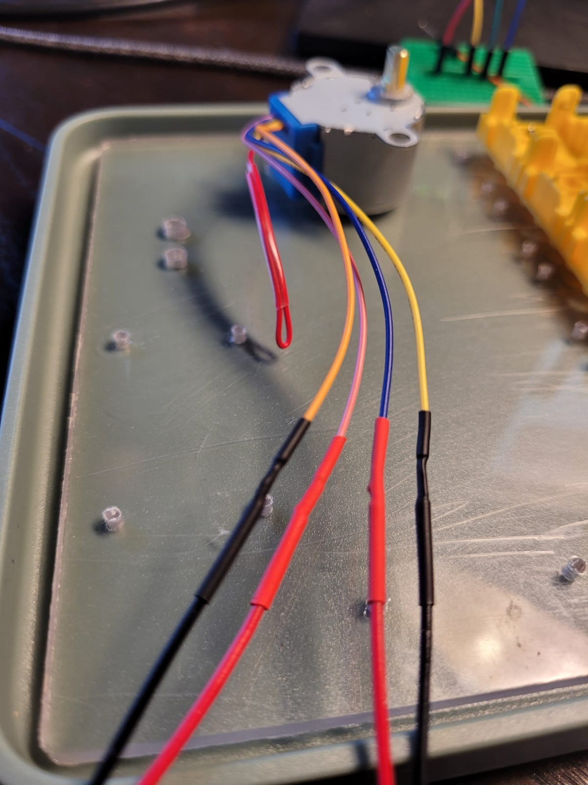
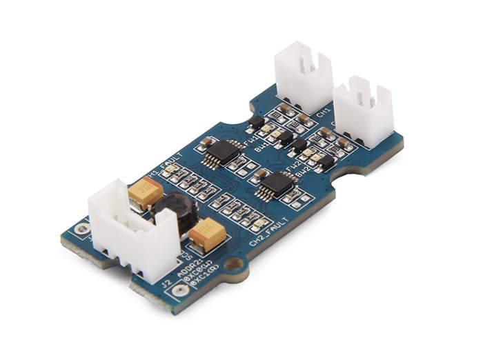

# 28BYJ-48 Bipolar Mod
## Introduction
The 28BYJ-48 is out of the factory a Unipolar Stepper Motor which, nowadays, are not that common anymore. Bipolar stepper motors are considered to be at least twice as efficient as an Unipolar motor for the same amount of copper on the windings.

## Bipolar Stepper Motor Unipolar Stepper Motor
According to research done by Jan Adriaensen the 28BYJ-48 in an Unipolar configuration can produce 300g.cm of torque half stepped and 380g.cm when full stepped, after the Bipolar mod you can expect the motor to produce 800g.cm of torque, that’s around 3x more efficient !

## Modding the motor
To perform the hardware mode is quite simple, just pry open the blue plastic cover having special attention not to hurt yourself, there are two plastic tabs one on each side of the cover which need to break free in order for the cover to come out. This may require a bit of force.

After the cover is out the PCB will be exposed, you’ll see three main thick traces, take a hobby knife and cut the middle trace by scrapping the PCB varnish and copper. In the end you should have a 1-2mm gap on the trace.

## PCB mod

The new motor windings will be 1 (Orange, Pink) and 2 (Yellow, Blue), you may cut the red wire on unsolder it from the PCB.

|Color	|Winding	|Side|Channel|header|
|------|--------|---------|---|----|
|Red	|N/A	|N/A||P1|
|Orange	|1	|A|CH1 (-)|P2|
|Yellow	|2	|A|CH2 (-)|P3|
|Pink	|1	|B|CH1 (+)|P4|
|Blue	|2	|B|CH2 (+)|P5|

## Driver
After performing the mod we can no longer use the ULN2003 board to drive the stepper motor, we now need a “H-Bridge” type of driver such as the A4988 or the DRV8825.

## Seeed Grove Mini I2C Motor Driver
[GitHub](https://github.com/Seeed-Studio/Drv8830_Motor_Driver)

