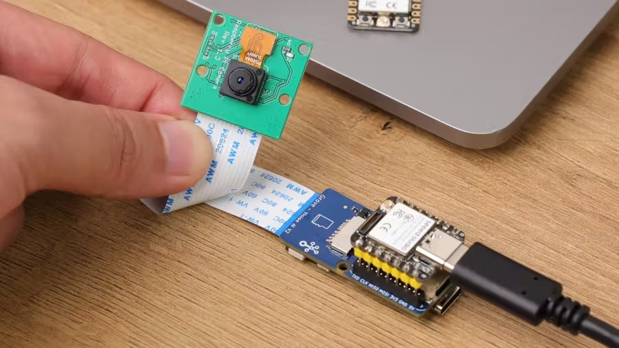
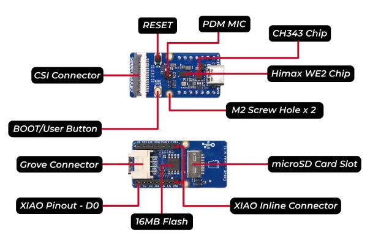
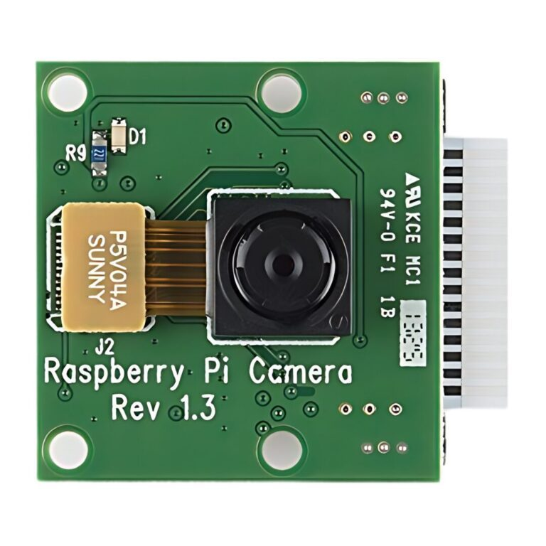

# Grove Vision AI → XIAO ESP32-S3 → T-SIM7080G-S3  
## End-to-End Image Transport, Verification, Storage & Time Synchronisation

This repository documents a **robust, multi-MCU image transport pipeline** designed for **edge AI vision**, **high-speed UART streaming**, **integrity verification**, **local persistence**, and **future cellular upload / SMS notification**.

The system is intentionally **crypto-free**, **deterministic**, and **observable**, prioritising reliability and debuggability on constrained embedded hardware.

---

## High-Level Architecture
```
Grove Vision AI
   │ (I2C)
   ▼
XIAO ESP32-S3 (Broker)
   │  UART2 @ 921600, CRC + ACK/NACK
   ▼
T-SIM7080G-S3 (Receiver)
   │
   ├─ JPEG decode + sanity check
   ├─ SD card storage
   └─ Modem ready for SMS / Cloud
```
## 1. Seeed Vision AI

The principal component of this development in the Seeed Vision AI V2 module that will contain the [Vespa Velutiona Detection model](https://sensecraft.seeed.cc/ai/view-model/61707-vespa-velutina-detection) which is available at the [SenseCraft AI website](https://sensecraft.seeed.cc/ai/home). This module is linked wiht the Raspberri Pi CAM V.13






---

## 2. Broker (XIAO ESP32-S3)

### Responsibilities

- Receives frames from **Grove Vision AI** over **I²C** using [SSCMA libraries from Seeed](https://github.com/Seeed-Studio/Seeed_Arduino_SSCMA)
- Encodes images as **Base64**
- Sends images over **UART** in framed messages
- Implements **CRC32 integrity checks**
- Uses **ACK / NACK** for reliable delivery (internal system, no crypto)

### Transport Protocol (Text-based, deterministic)
```
JSON { ... "frame": <id> ... }
IMAGE <base64_len> <crc32_hex>
<base64_payload>
END
```

### Reliability

- Each frame is acknowledged by the receiver:
  - `ACK <frame_id>`
  - `NACK <frame_id>`
- Broker retries on timeout or NACK
- No encryption, no compression beyond Base64
- Designed for **lossless UART streaming at high baud rates**

---

## 3. Receiver (T-SIM7080G-S3)

The receiver is **PlatformIO-based** and structured into **clear subsystems**.

---

## 4. Modem & PMU Initialization (UART1)

### Hardware Context

- Board: **LILYGO T-SIM7080G-S3**
- PMIC: **AXP2101**
- Modem: **SIM7080G**
- **Auto-boot modem design** (no PWRKEY toggling)

### Power Rails (Modem-critical only)

| Rail   | Voltage | Purpose |
|------|--------|---------|
| DCDC3 | 3.0 V  | Modem core / GNSS |
| BLDO2 | 3.3 V  | Modem I/O |

> ⚠️ **Camera rails are explicitly NOT enabled**  
> (to avoid brown-outs and UART instability)

### PMU I²C Configuration

| Signal | GPIO |
|------|------|
| SDA | GPIO15 |
| SCL | GPIO7 |
| I²C Addr | `0x34` |

### Modem UART (AT interface)

| Parameter | Value |
|---------|------|
| UART | `UART1` |
| TX | GPIO5 |
| RX | GPIO4 |
| Baud | 115200 |
| Flow control | Disabled |

### Modem Init Flow

1. **PMU configuration**
   - Clear fault registers
   - Set voltages
   - Enable DCDC3 + BLDO2
   - Stabilisation delay (≥100 ms)

2. **UART1 init**

3. **AT readiness**
   - Poll `AT` until `OK`
   - Autobaud lock

4. **Enable network time**
   - `AT+CLTS=1` (NITZ)
   - `AT+CTZR=1` (timezone)

5. **Wait for network registration**
   - `AT+CEREG?`
   - `AT+CREG?`
   - Accept `,1` (home) or `,5` (roaming)

6. **Timestamp retrieval**
   - `AT+CCLK?`
   - Retry until **plausible year (≥2020)**

### Timestamp Format

- Compact: `YYYYMMDD_HHMMSS`
- Used for:
  - Image filenames
  - Later cloud uploads
  - SMS notifications

---

## 5. SD Card Subsystem

### Interface

- **SD_MMC (1-bit mode)**

### GPIO Mapping

| Signal | GPIO |
|------|------|
| CLK | GPIO38 |
| CMD | GPIO39 |
| DATA | GPIO40 |

### Behaviour

- Initialized once during boot
- Graceful fallback if SD not present
- JPEG files stored as:
```
/frame_<frame_id>.jpg
```

---

## 6. Broker UART (UART2)

### Purpose

- Dedicated **high-speed image transport**
- Fully isolated from modem UART

### Configuration

| Parameter | Value |
|---------|------|
| UART | `UART2` |
| TX | GPIO17 |
| RX | GPIO18 |
| Baud | **921600** |
| Data | 8N1 |
| Flow control | Disabled |
| RX buffer | ≥ 4096 bytes |

### Why UART2?

- Avoids conflicts with:
  - USB CDC (UART0)
  - Modem AT interface (UART1)
- Ensures **non-blocking modem operation**
- Allows sustained high-throughput image streaming

---

## 7. Image Reception & Verification

### State Machine
```
WAIT_JSON
→ WAIT_IMAGE_HEADER
→ READ_IMAGE
→ WAIT_END
```

### Integrity Chain

1. **CRC32 on Base64 payload**
2. **Base64 decode → JPEG**
3. **JPEG sanity scan**
   - SOI (`FF D8`)
   - SOS marker
   - Proper EOI (`FF D9`)

### On Success

- Send `ACK <frame_id>`
- Save JPEG to SD card

### On Failure

- Send `NACK <frame_id>`
- Broker retries automatically

---
## 8. Inference (INF) Metadata Transport

In addition to raw images, the system transports **inference metadata (INF)** generated by the Grove Vision AI model. This metadata is sent **inline with each frame** from the broker to the receiver and logged on the receiver side.

---

### 8.1 Inference Data Source

* Inference is executed on **Grove Vision AI** using the **SSCMA runtime**
* The model produces:

  * Performance timing
  * Zero or more detection boxes
* All inference data is retrieved by the **XIAO ESP32-S3 broker** via I²C

---

### 8.2 Inference JSON Structure (Broker → Receiver)

The broker embeds inference data inside the `JSON` line of each frame.

Example:

```json
{
  "frame": 80,
  "perf": {
    "preprocess": 7,
    "inference": 37,
    "postprocess": 0
  },
  "boxes": [
    {"target":1,"score":31,"x":144,"y":406,"w":56,"h":83},
    {"target":2,"score":27,"x":170,"y":315,"w":64,"h":64}
  ]
}
```

---

### 8.3 Performance Metrics (`perf`)

| Field         | Unit | Description                      |
| ------------- | ---- | -------------------------------- |
| `preprocess`  | ms   | Image preprocessing time         |
| `inference`   | ms   | Neural network execution time    |
| `postprocess` | ms   | Post-processing / box extraction |

These values are directly provided by SSCMA and reflect **on-device model latency**.

---

### 8.4 Detection Boxes (`boxes`)

Each entry in `boxes[]` represents one detected object.

| Field    | Meaning                        |
| -------- | ------------------------------ |
| `target` | **Class ID** (model-defined)   |
| `score`  | Confidence score (model scale) |
| `x`      | Bounding box center X          |
| `y`      | Bounding box center Y          |
| `w`      | Bounding box width             |
| `h`      | Bounding box height            |

Coordinates are in **model output space**, not yet mapped to pixel space on the receiver.

---

### 8.5 Class IDs (`target`)

The model currently outputs **three distinct classes**.

> ⚠️ Class-to-label mapping is **model-specific** and must be defined alongside the model artifact.

Example (illustrative only):

| Class ID | Semantic Meaning     |
| -------- | -------------------- |
| `0`      | Background / ignored |
| `1`      | Primary target       |
| `2`      | Secondary target     |

The receiver **does not interpret class semantics**, it only logs raw IDs. Semantic interpretation is deferred to:

* Cloud processing
* Offline analysis
* Future on-device policy logic

---

### 8.6 Receiver Behaviour

On successful frame reception and CRC validation, the receiver:

* Parses inference metadata from `JSON`
* Logs:

  * Frame ID
  * Performance timings
  * Number of boxes
  * Per-box details
* Stores the JPEG image to SD card

Example log output:

```
🧠 INFERENCE
Frame      : 80
Perf (ms)  : pre=7 inf=37 post=0
Boxes      : 3
  #0 tgt=2 score=37.000 x=140 y=410 w=75 h=68
  #1 tgt=1 score=31.000 x=140 y=406 w=75 h=68
  #2 tgt=2 score=27.000 x=170 y=315 w=64 h=64
```

---

### 8.7 Design Intent

* Inference data is **losslessly coupled** to each image
* Transport is **text-based and deterministic**
* No inference logic exists on the receiver
* Enables:

  * Later cloud-side analytics
  * Dataset generation (image + labels)
  * Model validation in the field

---

This completes the **end-to-end perception data path**:

> **sensor → model → metadata → transport → storage → future uplink**

---

## 9. Design Principles

- **Single responsibility per UART**
- **Explicit power sequencing**
- **Fail-open where possible**
- **Fail-fast where necessary**
- **No hidden side effects**
- **Everything logged**

---

## 10. Future Extensions (Planned)

- HTTPD display of inference
- Relais actuators on XIAO
- LTE-M / NB-IoT upload of saved JPEGs
- SMS notifications with timestamp + metadata
- Cloud object storage integration
- PlatformIO build for broker

---

## 10. Status

✅ Stable  
✅ High-speed transport verified  
✅ CRC + ACK/NACK validated  
✅ JPEG integrity confirmed  
✅ SD persistence operational  
✅ Modem time synchronised  

---

**This system is now a solid foundation for autonomous, field-deployed vision nodes.**


