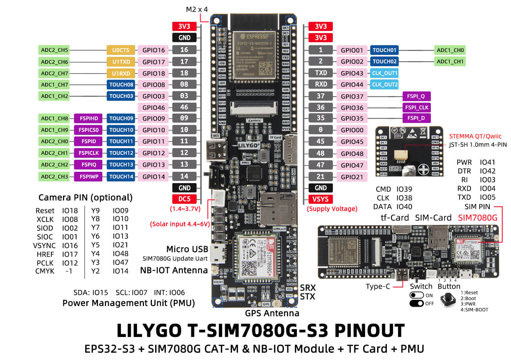

# SSCMA UART Receiver – T-SIM7080G-S3

This project implements a **high‑speed UART receiver and image logger** for an ESP32‑S3–based **LILYGO T‑SIM7080G‑S3** board. It is designed to receive AI inference results and JPEG frames from an external **SSCMA / Vision AI module** over UART, validate and acknowledge them, and store the images on an SD card with accurate timestamps derived from the cellular modem.

---
## Board Pinout



*Pinout diagram for the LILYGO T-SIM7080G-S3.*
For more details on the hardware and board documentation, see the
[LilyGO T-SIM7080G GitHub Repository](https://github.com/Xinyuan-LilyGO/LilyGo-T-SIM7080G).


## Overview

The firmware performs the following tasks:

* Initializes PMU power rails and the SIM7080G modem
* Retrieves network time from the modem and sets system RTC
* Listens on a high‑speed UART (921600 baud) for framed data
* Parses inference metadata (JSON)
* Receives Base64‑encoded JPEG images with CRC validation
* Decodes and sanity‑checks JPEG data
* Saves images to SD card using sequential frame IDs
* Sends ACK responses back to the sender

The system is optimized for **robust, streaming operation** with explicit state handling and integrity checks.

---

## Hardware

* **Board:** LILYGO T‑SIM7080G‑S3 (ESP32‑S3)
* **Modem:** SIM7080G (LTE‑M / NB‑IoT)
* **PMU:** AXP2101
* **SD card:** SD‑MMC (1‑bit mode)
* **External device:** SSCMA / Vision AI module (UART output)

### UART Connections

| Function  | ESP32‑S3 Pin | UART     |
| --------- | ------------ | -------- |
| Broker RX | GPIO 18      | UART2 RX |
| Broker TX | GPIO 17      | UART2 TX |
| Baudrate  | –            | 921600   |

### Modem & PMU Wiring

| Function     | Pin     |
| ------------ | ------- |
| Modem RX     | GPIO 4  |
| Modem TX     | GPIO 5  |
| Modem PWRKEY | GPIO 41 |
| PMU SDA      | GPIO 15 |
| PMU SCL      | GPIO 7  |

### SD‑MMC Pins

| Signal | Pin     |
| ------ | ------- |
| CMD    | GPIO 39 |
| CLK    | GPIO 38 |
| DATA   | GPIO 40 |

---

## Data Protocol (UART)

The external device sends data in **framed ASCII lines**:

### 1. JSON metadata

```
JSON {"frame":123,"label":"hornet","score":0.94,...}
```

### 2. Image header

```
IMAGE <base64_length> <crc32_hex>
```

### 3. Base64 image payload

```
<base64 JPEG data (exact length)>
```

### 4. Frame end

```
END
```

### 5. Acknowledgement (sent back)

```
ACK <frame_id>
```

---

## Runtime State Machine

The receiver operates as a strict state machine:

1. **WAIT_JSON** – waits for inference metadata
2. **WAIT_IMAGE_HEADER** – reads expected image length + CRC
3. **READ_IMAGE** – accumulates Base64 data
4. **WAIT_END** – validates CRC, decodes, saves, ACKs

Any failure resets the frame state cleanly.

---

## Time Synchronization

On boot:

1. PMU powers modem rails
2. Modem responds to AT
3. Network registration is verified
4. `AT+CCLK?` is queried
5. Timestamp is converted to:

```
YYYYMMDD_HHMMSS
```

6. System RTC is set via `settimeofday()`

Console output is **exactly**:

```
🕒 SYSTEM TIME SET: YYYY-MM-DD HH:MM:SS
```

This timestamp is used implicitly for file creation and logging.

---

## Image Validation

Before saving, each image is validated by:

* **CRC32** check on Base64 payload
* **Base64 decode** via mbedTLS
* **JPEG sanity scan**:

  * SOI marker (0xFFD8)
  * SOS marker (0xFFDA)
  * EOI marker (0xFFD9)

Only valid images are written to disk.

---

## SD Card Output

Images are stored at the SD root as:

```
/frame_000123.jpg
```

* Sequential numbering from `frame` field
* Written atomically per frame
* Logged with size confirmation

---

## Source Files

| File         | Responsibility                                   |
| ------------ | ------------------------------------------------ |
| `main.cpp`   | UART receiver, protocol handling, image pipeline |
| `modem.cpp`  | PMU control, modem init, network time            |
| `modem.h`    | Modem API                                        |
| `sdcard.cpp` | SD‑MMC init and JPEG storage                     |
| `sdcard.h`   | SD card API                                      |

---

## Libraries Used

* Arduino ESP32 Core
* TinyGSM (SIM7080)
* XPowersLib (AXP2101)
* SD_MMC
* mbedTLS (Base64)

---

## Notes

* Designed for **continuous unattended operation**
* Safe against partial frames and CRC mismatches
* No dynamic protocol assumptions
* High‑baud UART tested (921600)

---

## License

Project‑specific / internal use (add license as required).
